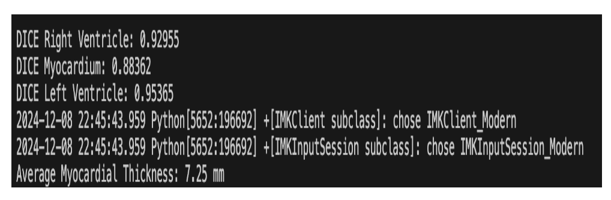

#Introduction

Analysis of cardiac function plays an important role in clinical cardiology for patient management, disease diagnosis, risk evaluation, and therapy decision. Thanks to digital imagery, the assessment of a set of complementary indices computed from different structures of the heart is a routine task for cardiac diagnostics. Because of its well-known capacity for discriminating different types of tissues, Cardiac MRI (CMR) (built from series of parallel short axis slices) is considered as the gold standard of cardiac function analysis through the assessment of the left and right ventricular ejection fractions (EF) and stroke volumes (SV), the left ventricle mass and the myocardium thicknexss. This requires accurate delineation of the left ventricular endocardium and epicardium, and of the right ventricular endocardium for both end diastolic (ED) and end systolic (ES) phase instances.

In clinical practice, semi-automatic segmentation is still a daily practice because of the lack of accuracy of fully-automatic cardiac segmentation methods. This leads to time-consuming tasks prone to intra- and inter-observer variability. In this project, I propose a Deep Learning (DL)-based algorithm using a 3D U-Net for segmenting myocardium and both ventricles in cardiac MRI. The semantic segmentation helps medical experts compute important indices such as ejection fraction and myocardium thickness, which are critical for diagnosing abnormalities in heart functioning.

#Dataset

I obtain cardiac MRI data from the MICCAI 2017 ACDC challenge https://acdc.creatis.insa-lyon.fr/
. It consists of cardiac CINE MRI of 100 patients with ground truth segmentation done by experts. The acquisitions were obtained over a 6-year period using two MRI scanners of different magnetic strengths (1.5 T (Siemens Area, Siemens Medical Solutions, Germany) and 3.0 T (Siemens Trio Tim, Siemens Medical Solutions, Germany)). Cine MR images were acquired in breath hold with a retrospective or prospective gating and with a SSFP sequence in short axis orientation.

The 100 patients are evenly divided into 5 classes with well-defined characteristics according to physiological parameters:

NOR: Normal cardiac anatomy and function

MINF: Myocardial infarction with systolic heart failure

DCM: Dilated cardiomyopathy

HCM: Hypertrophic cardiomyopathy

ARV: Abnormal right ventricle

#Architecture Description
3D U-Net

The 3D U-Net architecture is shown in Figure 1. It consists of an encoder–decoder structure with skip connections. The encoder progressively downsamples the input to extract global contextual features, while the decoder upsamples and reconstructs the segmentation map. Skip connections preserve spatial details by combining encoder features with decoder layers of matching resolution.

The final output is obtained through a softmax layer, producing probability maps for each class (Left Ventricle, Right Ventricle, Myocardium). This architecture is particularly effective in preserving intricate details of myocardial boundaries, which are crucial for accurate diagnosis.

Myocardium Thickness Calculation

In addition to segmentation, I implemented a method to calculate myocardium thickness. The thickness is computed using distance transforms by measuring the difference between the endocardium (inner wall) and epicardium (outer wall) layers of the left ventricle. This enables quantitative assessment of myocardial health, providing clinicians with clinically significant metrics for identifying abnormalities such as hypertrophy or thinning of the heart wall.

Description of Python Scripts

The codes have been written in Python 3.7 using the PyTorch v1.3.0 library.

trn_3DUNET.py : Training script for the 3D U-Net

tst_3DUNET.py : Testing script for the 3D U-Net

UNET3D_D4.py : A script defining the U-Net model

tst_dataset.py : A script for testing dataset creation

train_val_dataset.py : A script for training and validation dataset creation

myocardium_thickness.py : Script for calculating myocardium thickness using distance transforms

The trained models can be found on the google drive link: https://drive.google.com/drive/folders/1GdT2eqSDOmtiqchZ8pXj0oi0RAB3eMXO?usp=sharing

#Results
In the figure below, we show a representative slice from the dataset. The first panel is the original cardiac MRI, followed by the ground truth labels annotated by experts. The third panel shows the U-Net segmentation output, which closely matches the true labels. The last panel highlights the error map, where only small boundary-level differences are observed. This indicates that the model has learned to capture both the shape and boundary of the myocardium and ventricles with high accuracy.

And the below image represents the dice coefficient values of the above slice from the dataset which is to be of the patient 44 from the testing dataset.

#Conclusion

I applied a 3D U-Net to perform semantic segmentation of cardiac CINE MRI volumes across patients with different heart conditions. The architecture proved effective in handling dataset variations and accurately segmenting LV, RV, and myocardium.

Beyond segmentation, the implementation of myocardium thickness calculation using distance transforms provides an additional clinically meaningful metric. This combination of accurate segmentation and quantitative analysis strengthens the application of AI in cardiac imaging for diagnosis and risk evaluation.
